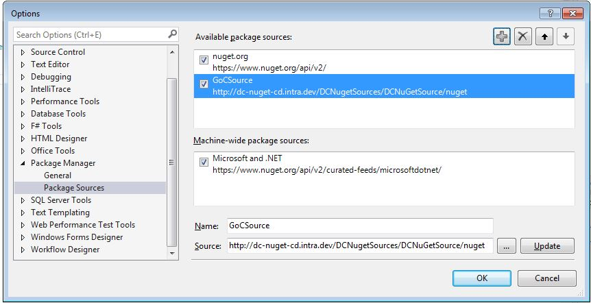
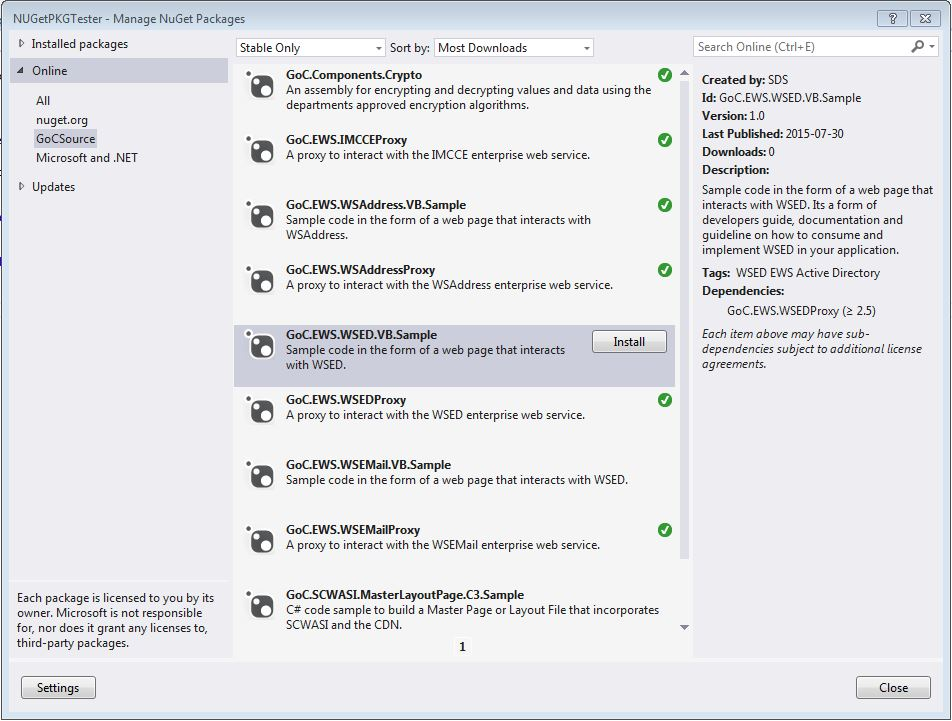

# NuGet User Guide  

The following information is to help you integrate the department's internal NuGet source to your Visual Studio.

NuGet is the package manager for the Microsoft development platform. A package in the context of NuGet can be an assembly, sample code and/or supporting files etc. NuGet provides a central package repository to view and publish the packages and from the repository the developer can choose to integrate a package into their .Net project. For more information about NuGet and its features, please visit <https://www.nuget.org/>.

## Why an Internal NuGet Source  

Many of our internally built components can be shared among our applications but should not be made publicly available. Having our own internal source will allow our community to share components and sample code while using the features of NuGet without having to worry about public access.  

## URL for the Internal Source

<https://jade-repos.intra.dev/artifactory/api/nuget/nuget-virtual>

## How to add the Internal Source to Visual Studios

Note: NuGet is included in Visual Studio 2012+. If you have Visual Studio 2010, NuGet is an add on, for information and the download, visit <https://visualstudiogallery.msdn.microsoft.com/27077b70-9dad-4c64-adcf-c7cf6bc9970c>

* Open Visual Studios
* From the menu "Tools\Library Package Manager" select "Package Manager Settings"
* From the "Options" window, select "Package Manager\Package Sources"
* Click the "+" button
* Enter a name for the source to be added (ex: GoCSource)
* Enter the url of the internal source provided above into the "Source:" field
* Click "OK"*



## How to view and install available packages

* Open a project in Visual Studios
* Right-click on the Project, and select "Manage NuGet Packages..."
* Select the internal source you added in the previous steps
* The list of available packages should be displayed in the center column and the description of the selected package will appear in the right column.
* Click the "Install" button to install this package into your project.
* What will this do?  
  * Add a "packages" folder at the top level of your projects folder
  * This "packages" folder holds the files required by the package
  * If dlls were included in the package, the reference to the dlls were added to your project
  * If config changes included in the package, your config file will be modified to include to entries
  * If the package has dependencies to other packages, those packages will also be installed



## How can I contribute

If you have a component or sample code that you would like to share, please contact SDS at DGIIT Services de conception des solutions / Solution Design Services IITB (EDSC/ESDC) <EDSC.DGIIT.SCS-SDS.IITB.ESDC@hrsdc-rhdcc.gc.ca>.

## Report a Problem

Contact SDS at DGIIT Services de conception des solutions / Solution Design Services IITB (EDSC/ESDC) <EDSC.DGIIT.SCS-SDS.IITB.ESDC@hrsdc-rhdcc.gc.ca>.

## Known Issues

### Input string was not in a correct format

Run this command from an elevated prompt to re-register the type library for VSLangProj.dll

```cmd
   regsvr32 "C:\Program Files (x86)\Common Files\microsoft shared\MSEnv\VsLangproj.olb"
```
